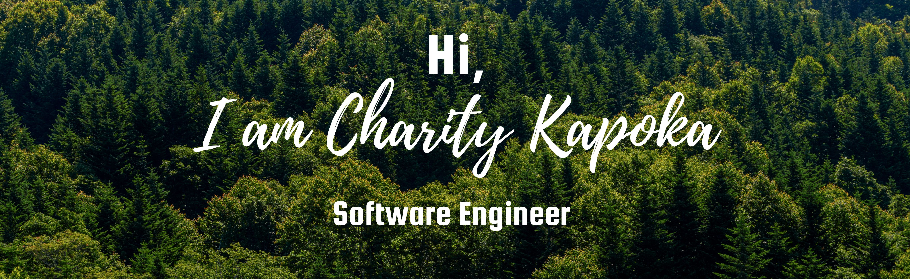

# 👋 Hi. Welcome to my GitHub!!!

***

* 👩🏻‍💻 I recently completed the Digital Futures 12 week Software Engineering academy.
* 📚 I started my journey in 2017, with a Degree in Software Engineering at the University of Salford.
* 👀 I'm interested in learning further technologies.
* 🌱 I’m currently preparing the Java SE 1Z0-811 certification.
* 💻 I'm working on a full stack project using React, NodeJS and MongoDB.

***
 
