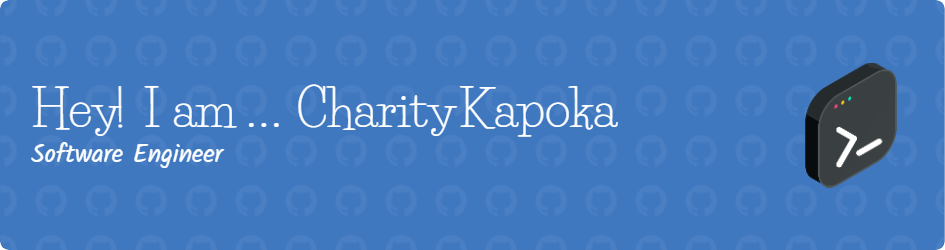
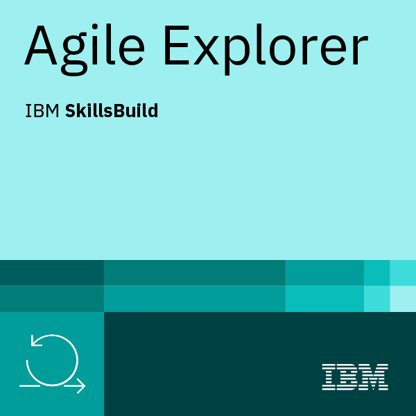

# 👋 Hi. Welcome to my GitHub!!!

* 👩🏻‍💻 I recently completed the Digital Futures 12 week Software Engineering academy.
* 📚 I started my journey in 2017, with a Degree in Software Engineering at the University of Salford.
* 👀 I'm interested in learning further technologies.
* 🌱 I’m currently preparing the Java SE 1Z0-811 certification.
* 💻 I'm working on a full stack project using React, NodeJS and MongoDB.

## 💼 Technical Skills

🧪 Testing

📋 Languages

 
 
 
 
 

## 📈 GitHub Stats 

 
